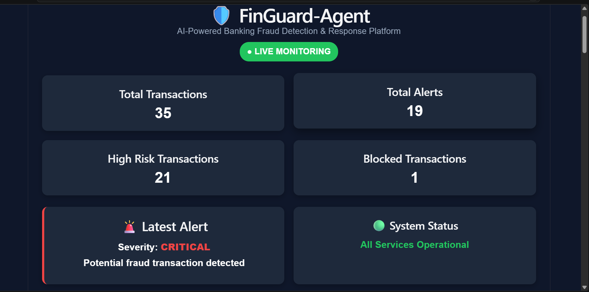
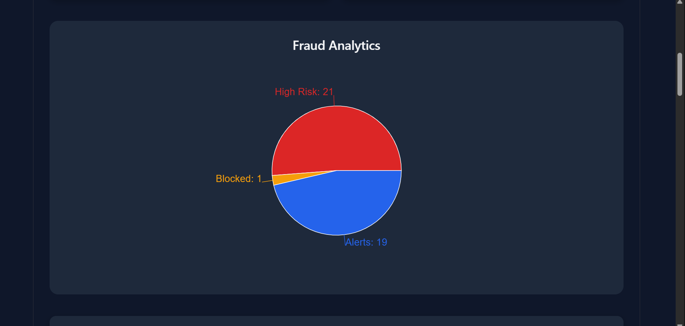
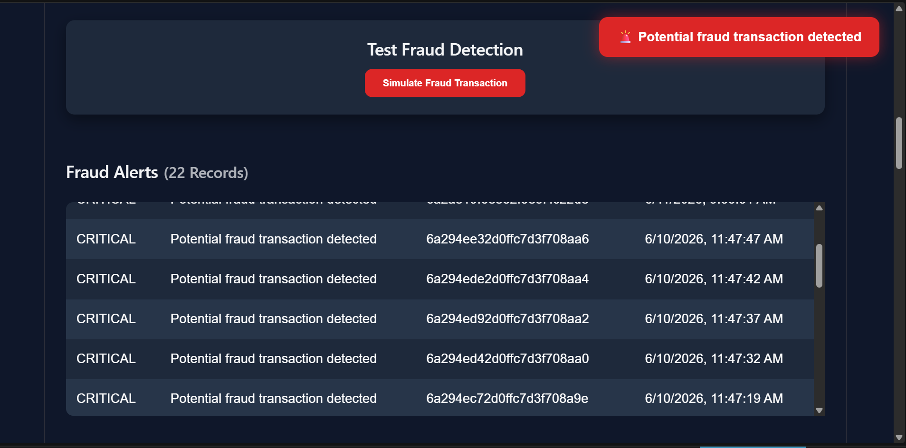
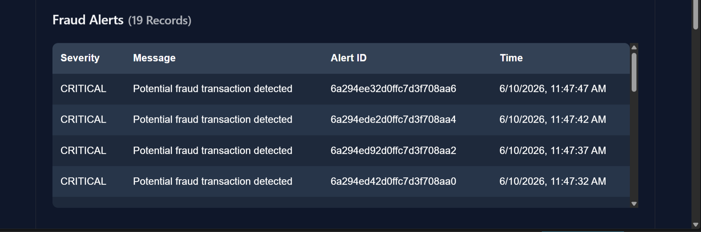
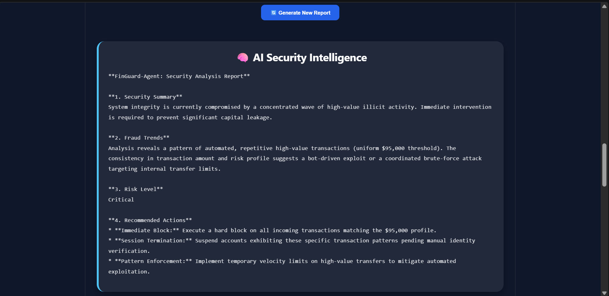
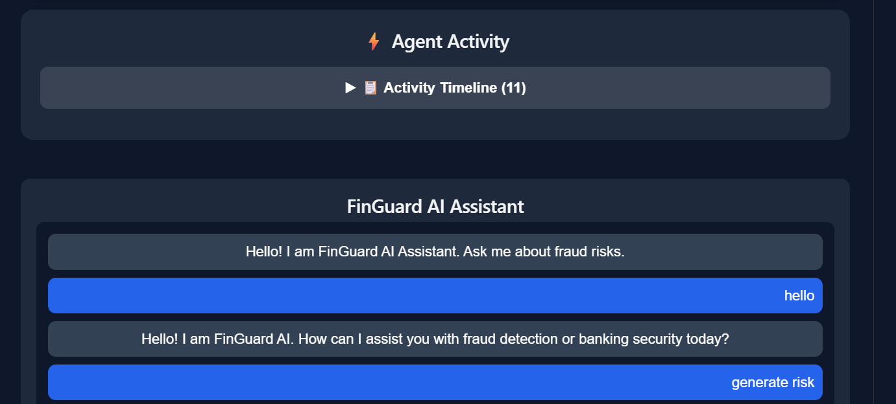
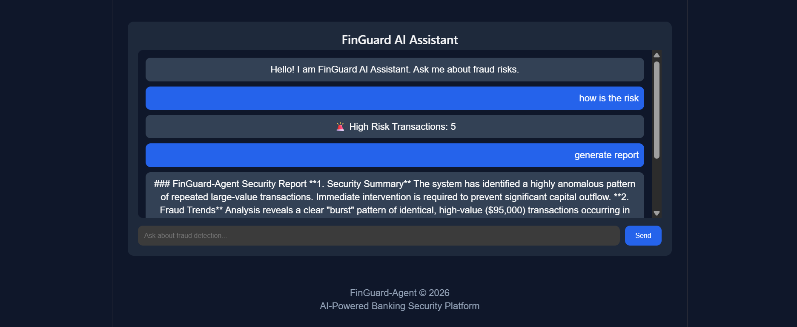

# 🛡️ FinGuard-Agent

## AI-Powered Banking Fraud Detection & Autonomous Response Platform

FinGuard-Agent is an intelligent banking security platform that continuously monitors financial transactions, detects fraudulent activity in real time, generates AI-powered security reports, and autonomously recommends or executes mitigation actions.

The platform combines AI agents, fraud analytics, autonomous decision-making, and security intelligence into a unified monitoring dashboard.

---

# 🚀 Features

## 🔍 Real-Time Fraud Monitoring

- Live transaction monitoring
- Continuous fraud risk evaluation
- Real-time dashboard updates
- Automatic alert generation
- Transaction activity tracking

---

## 🤖 AI Security Agent

- Gemini-powered AI assistant
- Fraud investigation support
- Security intelligence generation
- Natural language security queries
- AI-powered recommendations

---

## 🚨 Fraud Detection Engine

Detects suspicious transactions using:

- High-value transaction analysis
- Foreign transaction detection
- New device identification
- Failed login attempt monitoring
- Odd-hour transaction analysis
- Behavioral risk indicators

---

## 🛑 Autonomous Response Engine

- Automatic fraud response
- High-risk transaction blocking
- Critical alert generation
- Security event logging
- Activity timeline management

---

## 📊 Interactive Analytics Dashboard

- Fraud analytics visualization
- Security monitoring dashboard
- Alert management
- Transaction monitoring
- Risk-level filtering
- Live system status

---

## 📄 AI Security Intelligence Reports

Generate detailed reports including:

- Security summaries
- Fraud trend analysis
- Risk assessments
- Attack pattern detection
- Recommended mitigation actions

---

# 🏗️ System Architecture

```text
User
 │
 ▼
React Dashboard
 │
 ▼
FastAPI Backend
 │
 ├── Risk Engine
 ├── Alert Engine
 ├── Action Engine
 ├── Gemini AI Agent
 │
 ▼
MongoDB Atlas
```

---

# 🧠 AI Workflow

```text
Transaction
     │
     ▼
Risk Analysis
     │
     ▼
Fraud Detection
     │
     ▼
Alert Generation
     │
     ▼
Response Decision
     │
     ▼
Block / Monitor / Escalate
     │
     ▼
AI Security Report
```

---

# 🛠️ Tech Stack

## Frontend

- React.js
- Vite
- Axios
- Recharts
- CSS3

## Backend

- FastAPI
- Python
- Uvicorn

## Database

- MongoDB Atlas

## AI Layer

- Google Gemini
- Custom Risk Engine
- Alert Engine
- Action Engine

---

# 📸 Project Screenshots

## Dashboard Overview

Main monitoring dashboard showing system metrics and fraud statistics.



---

## Fraud Analytics

Interactive fraud analytics visualization.



---

## Fraud Alerts

Real-time fraud alerts generated by the system.



---

## Alert Management Table

Complete fraud alert records with timestamps and severity levels.



---

## Transaction Monitoring

Transaction monitoring with AI risk analysis and filtering.


---

## AI Security Intelligence Report

AI-generated security analysis and recommendations.



---

## Agent Activity Feed

Compact activity monitoring panel.



---

## Expanded Activity Timeline

Grouped and expandable activity timeline showing fraud events, AI actions, reports, and user interactions.


---

## AI Assistant

Gemini-powered banking security assistant.



---

# ⚙️ Installation

## 1. Clone Repository

```bash
git clone <your-repository-url>
cd FinGuard-Agent
```

---

## 2. Backend Setup

```bash
cd backend

python -m venv venv

venv\Scripts\activate

pip install -r requirements.txt

uvicorn main:app --reload
```

Backend Server:

```text
http://127.0.0.1:8000
```

---

## 3. Frontend Setup

```bash
cd frontend

npm install

npm run dev
```

Frontend Server:

```text
http://localhost:5173
```

---

# 🔄 API Endpoints

## Dashboard Statistics

```http
GET /dashboard-stats
```

Returns platform statistics.

---

## Fetch Alerts

```http
GET /alerts
```

Returns fraud alerts.

---

## Fetch Transactions

```http
GET /transactions
```

Returns monitored transactions.

---

## Fraud Analysis

```http
POST /analyze
```

Analyzes transaction risk.

---

## AI Chat Assistant

```http
POST /chat
```

Interact with FinGuard AI Assistant.

---

## Security Intelligence Report

```http
GET /agent-insights
```

Generate AI security reports.

---

# 📈 Current Capabilities

✅ Real-Time Monitoring

✅ Fraud Detection

✅ Risk Analysis

✅ Alert Generation

✅ Autonomous Response Actions

✅ AI Security Reports

✅ Gemini AI Assistant

✅ Interactive Dashboard

✅ Transaction Monitoring

✅ Activity Timeline

✅ Analytics Visualization

✅ MongoDB Data Storage

---

# 🎯 Future Enhancements

- Multi-bank integration
- Cloud deployment
- User authentication
- Role-based dashboards
- Email notifications
- SMS alerts
- Predictive fraud modeling
- Behavioral biometrics
- Agent-to-Agent collaboration
- Advanced anomaly detection

---

# 👨‍💻 Developer

### Lovely Chourasia

FinGuard-Agent was developed as an AI-powered autonomous banking security platform demonstrating intelligent fraud detection, AI-driven security intelligence, autonomous decision-making, and real-time monitoring capabilities.

---

# 📄 License

Licensed under the MIT License.

See the LICENSE file for details.